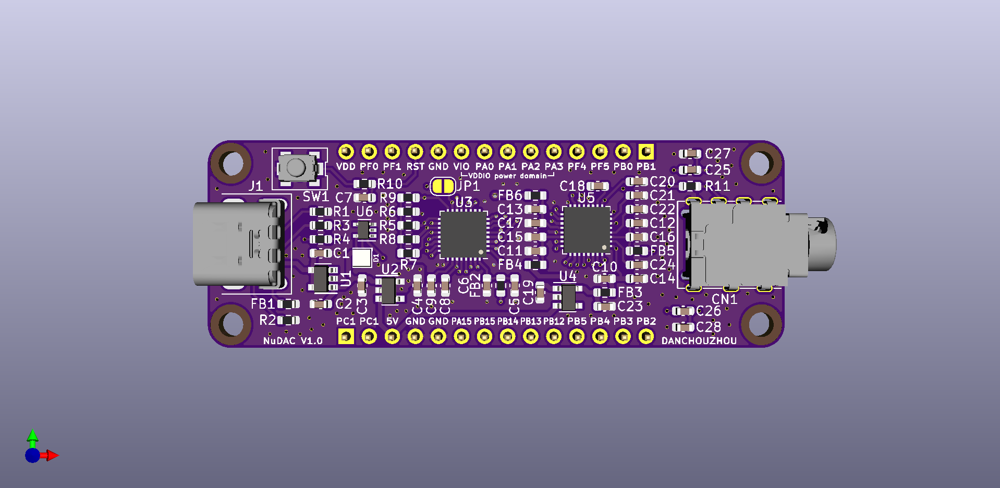

# NuDAC
A USB codec based on Nuvoton M482ZGCAE MCU and NAU88L25YGB I2S audio codec


## Fetures
### Design
- Provide almost all of MCU I/O on pin header  
- Low noise & fail-safe power design  
- Four-layer PCB  
- Low profile mid mount THT phone jack  
- On board APA ELECTRONIC CO., LTD. patented RGB LED with level translator  
- Molex USB 2.0 through hole Type-C connector improve mechanical strength  
- Jump free Nu-Link connectivity
- Support semi-auto USB ISP (by pressing reset button) provide firmware update and secondary development without a programmer  
### Nuvoton M482ZGCAE microcontroller  
- ARM Cortex-M4 processor up to 192MHz with float point unit and DSP  
- 16-channel programable peripheral direct memory access  
- USB 2.0 full-speed with precise internal oscillator  
- Rich interface include UART, SPI, IIC, IIS, LIN
- 12-bit ADC and DAC
- 16-bit PWM
- True random number generator  
### Nuvoton NAU88L25YGB high performance audio codec
- On chip ground referenced Class-G headphone amplifier
- On chip DSP include DRC (Dynamic Range Compressor), and programmable biquad filters  
- 124dB SNR (@ 1Vrms, 0dB gain, 1KHz)  
- THD+Noise -89dB (@ 32 ohm, 1KHz, 20mW)  
- 28mW output power (@ 32 ohm, 1% THD+N)  

## Specification
- Power supply: 3.9~5.5V, 1A max  
- 5V output capacity: 1A max
- VDD output capacity: 300mA max


## To clone this project
This project work with M480BSP submodule from Nuvoton corporation. You need to initialize submodules by passing ``--recurse-submodules`` to the ``git clone`` command.
```
git clone https://github.com/danchouzhou/NuDAC --recurse-submodules
```

## Prepare develop environment
1. Installing tools
```
sudo apt install kicad build-essential gcc-arm-none-eabi libtool libusb-1.0-0-dev
```
2. Build and install customize version of OpenOCD for Nuvoton devices
```
git clone https://github.com/OpenNuvoton/OpenOCD-Nuvoton.git
cd OpenOCD-Nuvoton
./bootstrap
./configure --enable-nulink
make
sudo make install
```
